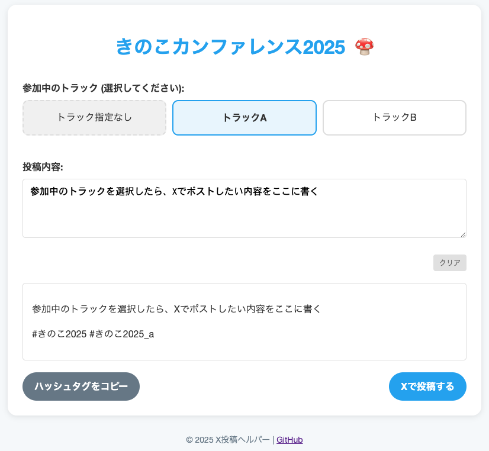

# X投稿ヘルパー (x-post-helper)

## 概要

X投稿ヘルパーは、カンファレンスやイベント開催中に参加者がX (旧Twitter) へ簡単に投稿できるよう支援するWebアプリケーションです。

イベント主催者は、事前にイベント情報（ハッシュタグ、トラック情報など）を登録することで、参加者向けの専用投稿ページを生成できます。参加者はこのページを通じて、イベントの公式ハッシュタグや、参加中のトラックに応じたハッシュタグを自動で含めた投稿を作成できます。

_イベントページのサンプル（きのこカンファレンス2025）_

## イベントページ作成を依頼したい方へ

X投稿ヘルパーを使ったイベント用投稿ページの作成をご希望の場合は、以下のフォームよりお申し込みください。

**申請方法:** [申請フォームより情報を入力してください](https://forms.gle/Q3k3ykvMeTthqbCD9)

**申請期限:** イベント開催日の**2日前**までを目安にお願いします

**サンプルページ:**
実際に作成されるイベントページのサンプルはこちらで確認できます。
[きのこカンファレンス2025 サンプルページ](https://yonetty.github.io/x-post-helper/events/kinoko2025)
